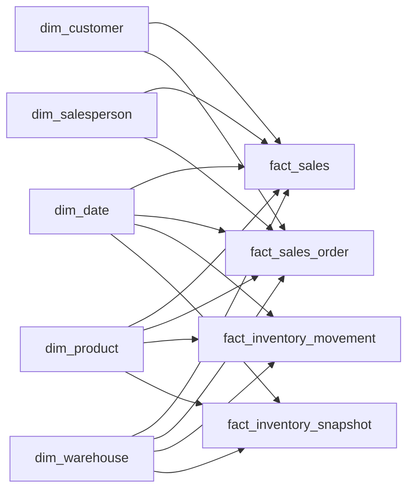

# EOIP Dimensional Model & Star Schema

## Purpose

EOIP-05 transforms normalized staging data into a dimensional model designed for Power BI and governed KPI engineering.

The model deliberately contains **base analytical measures**, not final business KPIs. KPI definitions and DAX belong to EOIP-06.

## Star schema



## Dimensions

### dim_date

**Grain:** one row per calendar date.

Provides calendar attributes required for period comparisons and Power BI time filtering.

### dim_customer

**Grain:** one row per customer.

Contains stable commercial segmentation attributes. Salesperson is not embedded because salesperson also exists as a separate conformed dimension.

### dim_product

**Grain:** one row per product.

Product category is flattened into the product dimension for straightforward analytical slicing. Supplier ID remains contextual master-data lineage; supplier analytics are not EOIP V1 scope.

### dim_warehouse

**Grain:** one row per physical warehouse.

### dim_salesperson

**Grain:** one row per commercial owner.

## Facts

### fact_sales

**Grain:** one row per posted invoice or credit-memo line.

Base measures:

- quantity_signed
- gross_sales_signed
- discount_signed
- net_sales_signed
- cogs_signed

Credit memos are negative for quantity, sales and COGS. Gross profit is intentionally **not** stored as an independent business definition; it is derived from net sales and COGS in the semantic/KPI layer.

Actual COGS is traced from `value_entry` through `stg.value_movement`.

### fact_sales_order

**Grain:** one row per sales-order line.

Supports:

- order volume
- invoiced quantity
- outstanding quantity
- open-demand analysis
- promised-delivery context
- later stockout-risk logic

### fact_inventory_movement

**Grain:** one row per inventory ledger entry.

Contains both:

- physical quantity movement
- normalized inventory asset-value movement

The normalized inventory-value movement is intentionally separate from the raw `cost_amount_actual`, whose accounting meaning differs by entry type.

### fact_inventory_snapshot

**Grain:** one row per snapshot date × product × warehouse.

Contains:

- on-hand quantity
- reserved quantity
- available quantity
- unit cost at snapshot
- inventory value at standard cost

EOIP V1 uses standard-cost snapshot valuation for transparent working-capital analysis. More advanced inventory costing is not introduced merely to inflate technical scope.

## Surrogate keys

All business dimensions use surrogate numeric keys in the warehouse while preserving source IDs as durable lineage attributes.

Fact loads resolve every dimensional natural key at load time; unresolved keys are treated as model-quality failures rather than silently replaced with arbitrary values.

## Refresh

The dimensional model is rebuilt reproducibly from the staging layer:

```text
raw → stg → dw dimensions → dw facts
```

The refresh is version controlled in:

`sql/transforms/010_refresh_dw.sql`

A clean rebuild resets surrogate keys and inserts dimensions in stable natural-key order.

## Scope boundary

EOIP-05 does **not** define:

- final DAX measures
- KPI targets
- report visuals
- ABC/XYZ
- safety stock
- cost-to-serve
- supplier performance

Those remain later work packages/projects.
